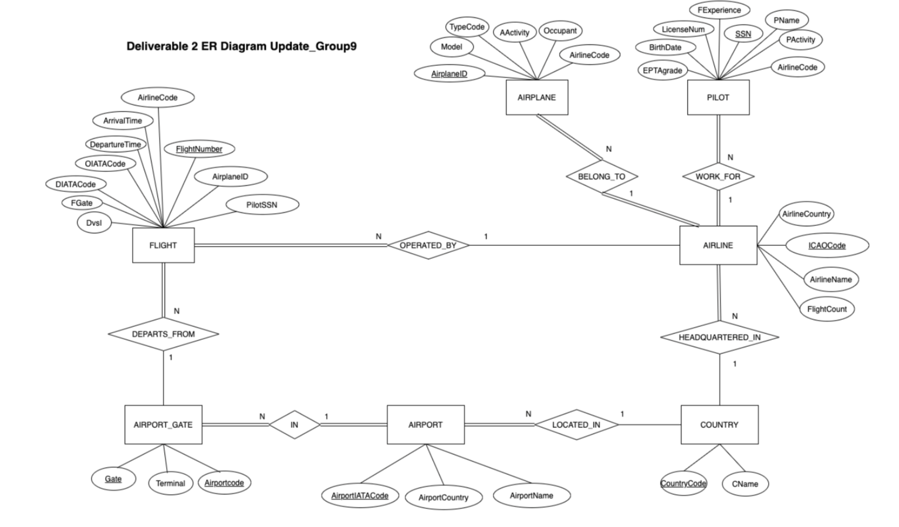
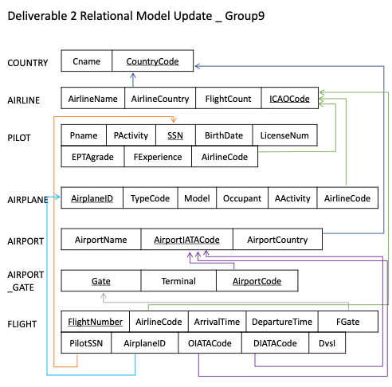

# Flight Management Application

## Overview
The following guidelines contain the way how to create the database, compile the source code and start the application.   
Before starting the application, create a database instance named "FLIGHT_MANAGEMENT" in MySQL and load the sample data into the FLIGHT_MANAGEMENT space in MySQL.
(Using FlightManagementInit.sql)

## E-R Diagram

## Relational Model

## Guidelines

* Open your command line interface.

* Use the “cd” command to move to the directory that contains java files.

      cd /Users/gartuaden/Desktop/jdbc/src/FlightManagement

* Use the “export” command on Mac OS or "SET" command on Window to define the CLASSPATH variable as the JDBC driver jar file’s path.

      export CLASSPATH=$CLASSPATH:/Library/Java/JavaVirtualMachines/jdk1.8.0_281.jdk/Contents/Home/jre/lib/ext/mysql-connector-java-8.0.23.jar

* Compile the java files using the "javac" command.

      javac FlightManage.java

* Move to the “src” directory using the “cd ..” command to move one directory upwards.

* Use the “java” command to invoke each query. Use your url, user id, password and driver. Then the screen will pop up and the application will start.

      java FlightManagement.FlightManage jdbc:mysql://localhost:3306/FLIGHT_MANAGEMENT root <YOUR PASSWORD> com.mysql.cj.jdbc.Driver

## Application Information

0. Main Page: Flight search(1) and Flight schedule(2)

1. For flight search, there are 4 search buttons: search by flight date at a specific airport, search by pilot, search by airport, search by airline.

  * 1.1 Enter Airport code, flight date in turn. All airport names and airport codes show in the page -> Click the button then result of search flights departing on that day from that airport.
  * 1.2 Enter pilot SSN. All pilot information shows in the page -> Click the button then result of search flights of the pilot.
  * 1.3 Enter departure airport and arrival airport in turn. Enter * to include all airports. (ex. * PHX or PHX *) All airport names and airport codes show in the page -> Click the button then result of search flights departing from origin airport or arriving at destination airport.
  * 1.4 Enter the airline code you want to find. All airline information shows in the page -> Click the button then result of search flights of the airline.

2. Schedule a new flight.

  * 2.1 Enter departure airport, departure time, arrival airport, and arrival time.
  * 2.2 Print out the list of information of airlines headquartered in the country of departure or arrival airport -> Enter desired airline
  * 2.3 Print out the list of available airplane for the airline (airplanes should not be scheduled for one days before or after departure date) -> Enter the airplane ID
  * 2.4 Print the list of possible pilots for the airline (Pilots not assigned for one days before and after departure date) -> Enter the SSN of the pilot.
  * 2.5 For that departure time, print out the list of empty gates at that departure airport (gate not assigned to 2 hours before and after departure time) -> Enter the gate to use
  * 2.6 Insert into flight. When all information has been entered, the program distinguishes whether the flight is international or domestic. If flight insert is executed successfully, the comment like ‘your flight is successfully scheduled’ shows. The flight time is automatically added to the flight experience of the pilot and the flight count of the airline increases too.

## Application Demo Video
Youtube Link: <https://youtu.be/y2Wo_689g_g>
